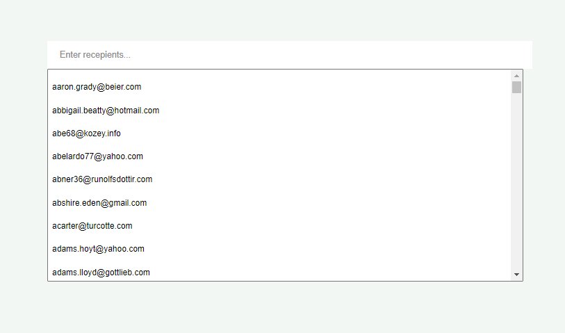

# Emaildistributer

Application to distribute the customer emails

### To install application dependencies

Download the application, go to the root folder Emaildistributer and run the following command

      npm install

**Note:** This step has to be performed only once.

### To run the application

Go to the root folder Emaildistributer and run the following command

    npm start

To run backend and frontend sepeartely, use the follwing commands,

### Hooks used

1. Frontend - React

   - useState: Manages state
   - useMemo: Used only once to load the email list
   - useEffect: Trigger the dom update and useMemo

### Unique features implemented

- Used contentEditable attribute n div to get the styled input.
- Dropdown that filters
- Mimicing the API and fetching the email list only once to improve overall performance
- Show errored entered value

### Screenshots

### Future scope

- Add more refined css
- Add external library to have a great look like react-bootstrap
- Ease up devlopement using redux, react-dom
- Make it look exactly same as provided in Figma but could not due to time constraints.

### Unique approach used

1. Used input element with multi Datalist html tag: Did not work

- approch failed since we can not add styled input value (i.e. input value attribute can not be another html tag)
- So, I have to add the entered input above the input tag instead of adding them inside.
- To see approach 1 please rename App2.js to App.js and App2.css to app.css

2. ContentEditable div with multi select dropdown: Worked

- This approach worked since the ContentEditable div allows its value to be styled.

### References

[1] [https://reactjs.org/](https://reactjs.org/)
